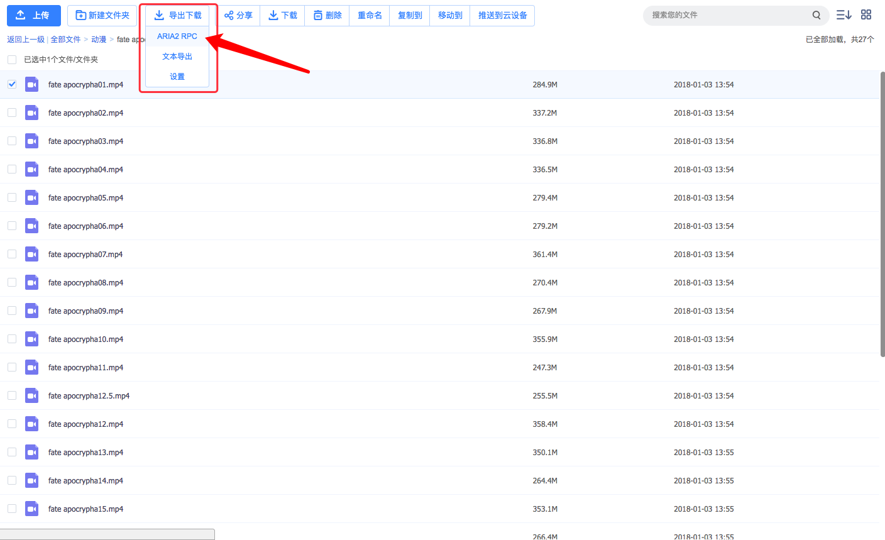

## aria2绕过度云限速

1. 下载Chrome插件: baiduexporter
2. 下载aria2:

> Mac

下载 [aria2gui](https://github.com/yangshun1029/aria2gui/releases) 一路点到底

> Win

下载 [aria2](https://github.com/aria2/aria2/releases)

进入下载好的文件夹

创建aria2.conf,文件内容：

```
dir=下载到哪个目录

log=日志保存路径

input-file=aria2路径\aria2.session

save-session=aria2路径\aria2.session

save-session-interval=60

force-save=true

log-level=error

# see --split option

max-concurrent-downloads=5

continue=true

max-overall-download-limit=0

max-overall-upload-limit=50K

max-upload-limit=20

# Http/FTP options

connect-timeout=120

lowest-speed-limit=10K

max-connection-per-server=10

max-file-not-found=2

min-split-size=1M

split=5

check-certificate=false

http-no-cache=true

# FTP Specific Options

# BT/PT Setting

bt-enable-lpd=true

#bt-max-peers=55

follow-torrent=true

enable-dht6=false

bt-seed-unverified

rpc-save-upload-metadata=true

bt-hash-check-seed

bt-remove-unselected-file

bt-request-peer-speed-limit=100K

seed-ratio=0.0

# Metalink Specific Options

# RPC Options

enable-rpc=true

pause=false

rpc-allow-origin-all=true

rpc-listen-all=true

rpc-save-upload-metadata=true

rpc-secure=false

# Advanced Options

daemon=true

disable-ipv6=true

enable-mmap=true

file-allocation=falloc 

max-download-result=120

#no-file-allocation-limit=32M

force-sequential=true

parameterized-uri=true

```

改前四行

然后启动aria2:

```bash
cd aria2目录

aria2c.exe --conf-path="./aria2.conf" -D
```

